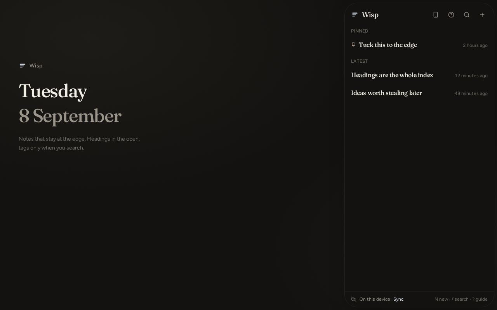
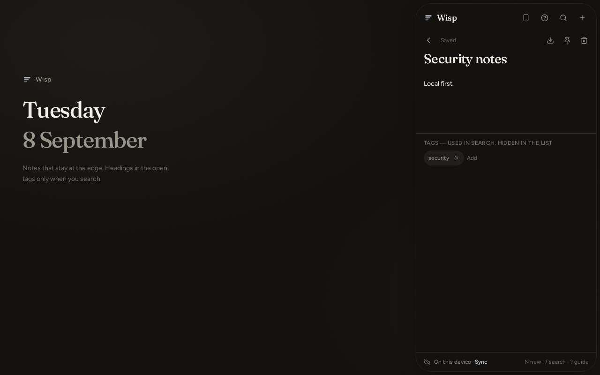
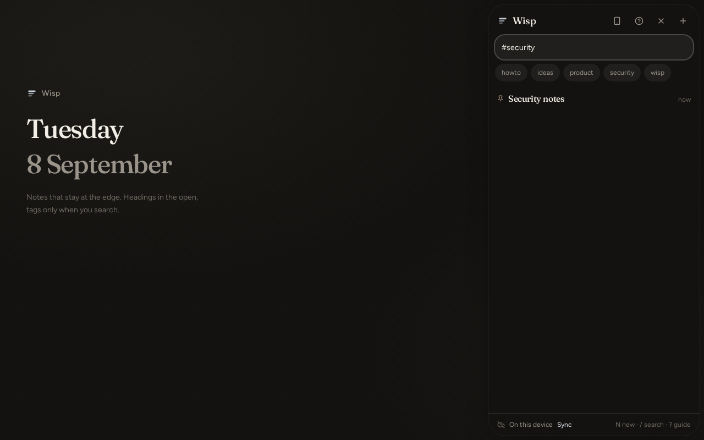

# Wisp

**Notes that stay at the edge.**

Wisp is a tiny, heading-first notes app designed to stay within reach without taking over your screen. Write a heading. Tuck it away. Get back to whatever you were doing.

It is personal-first, not SaaS-first. There is no Wisp cloud you are required to join. Clone it. Fork it. Run it on a machine you own.

<p align="center">
  
</p>

<p align="center">
  
  &nbsp;
  
</p>

<p align="center">
  
  &nbsp;
  
</p>

---

## Why it exists

Most notes apps make you open the app first.

Wisp reverses that.

The note is already at the edge. Open it. Write something. Give it a heading. Disappear again.

## Product principles

**Heading first.** The index stays simple. One line per thought.

**Edge first.** Available without occupying the centre of the workspace.

**Instant capture.** The distance between thought and saved note should be tiny.

**Tags for retrieval.** Tags exist to help find things, not to turn the interface into metadata soup.

**Offline first.** No internet should not mean no notes. No account should not mean no notes.

**Sync when you want it.** Your devices can share the same memory when you choose — pairing, a file, or optional sign-in. Never because a vendor said so.

**Small on purpose.** Wisp is not trying to become another enormous productivity suite.

---

## What you can do today

- Right-edge glass panel, tucked handle, live note count
- Swipe in from the right on a phone
- Heading-only list with relative time and pins
- Instant capture (`N`), search (`/` or `Ctrl+K`), tuck (`Esc`)
- `#tag` filtering — tags hidden until you search
- Offline persistence in the browser
- JSON backup / import (`wisp.backup.v1`)
- Markdown export of a single note
- Optional Google / X sync if you want a server copy
- Device pairing (QR + code) and signed note snapshots (`wisp.peer-sync.v1`)
- PWA install (Chrome, Edge, Android, iOS Add to Home Screen)

```
N        →   New note
/        →   Search
#ideas   →   Find ideas
Esc      →   Disappear
```

---

## Pairing

Connecting personal devices should feel like pairing two machines, not creating another online account.

```
Laptop                         Phone
  │                              │
  │  1. Scan QR / enter code     │
  │  2. Confirm the other way    │
  │  3. Keys stored locally      │
  │                              │
  │  4. Save signed snapshot  ──►│  verify + merge
```

Pairing mints a short-lived secret (five minutes, single use) and stores Ed25519 device keys. That secret is **not** a password.

Notes then move as a **signed file** (`wisp.peer-sync.v1`). The receiving device rejects it unless the signer is already trusted. This is offline, has no Wisp relay, and is **not** live two-way sync. Live transport is later. Until then, the snapshot, a regular backup, or optional sign-in are the ways two screens share memory.

A failed or expired pairing does not touch existing notes.

---

## Local-first

```
                 Wisp
                   │
          ┌────────┴────────┐
          │                 │
      Local data       Optional sync
          │                 │
       Offline        Your infrastructure
```

Wisp does not fundamentally require a central Wisp cloud. You choose whether anything leaves the device.

When you do sync, you should eventually control the infrastructure. Optional Better Auth + Postgres is the path that already exists in this repo. A smaller self-hosted daemon and direct peer sync are planned — see [docs/architecture.md](docs/architecture.md) and [docs/self-hosting.md](docs/self-hosting.md).

---

## Privacy, honestly

Notes live on the device first.

If you sign in or import/export a backup, notes move because **you** asked. The app does not include analytics or telemetry.

Do not read “never leaves your device” here. Sync is real when you turn it on.

---

## Stack

React 19, TanStack Start & Router, Tailwind CSS v4, Zustand, Zod, Better Auth (optional), Postgres / PGLite, PWA tooling, `uqr` for pairing codes.

```
src/components/wisp/     UI — panel, list, editor, guide, devices
src/lib/notes/           Note model, store, search, backup, sync RPCs
src/lib/pairing/         Device identity, QR/code handshake, trust
src/lib/auth/            Optional Better Auth (do not rewrite)
migrations/              Auth + notes schema
docs/                    Architecture, self-hosting, native shells
```

---

## Develop

Node 22+ and npm.

```sh
npm install
npm run dev          # port 8080
npm run typecheck
npm test
npm run lint
npm run build
```

## Install as a PWA

- **Chrome / Edge / Android** — menu → Install app / Add to Home screen.
- **iPhone** — Safari Share → Add to Home Screen. iOS cannot grant a third-party system-wide edge overlay.

A real `.exe` / `.apk` is a later packaging step (Tauri / Capacitor), not a rewrite. Details: [docs/native.md](docs/native.md).

---

## Roadmap

**Already here** — the overlay, capture, search, backup, optional account sync, pairing, signed device snapshots, PWA.

**Next** — live device-to-device transport, Tauri desktop shell (always-on-top, hotkey, tray, data directory you pick), Capacitor Android.

**Exploring** — self-hosted sync daemon, encryption at rest, richer conflict UI, richer local search.

No dates. No store listing required.

## Non-goals

Wisp is not Notion, Evernote, a project-management suite, a social network, an AI chatbot, a collaboration platform, or an all-in-one productivity suite. The simplicity is the product.

## Contributing

Fork it. Break it. Open an issue. Send a small change. Keep the core small — personal workflow over growth metrics.

---

Write it down. Get it out of your head. Let Wisp disappear again.
