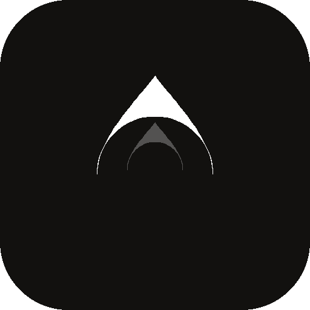
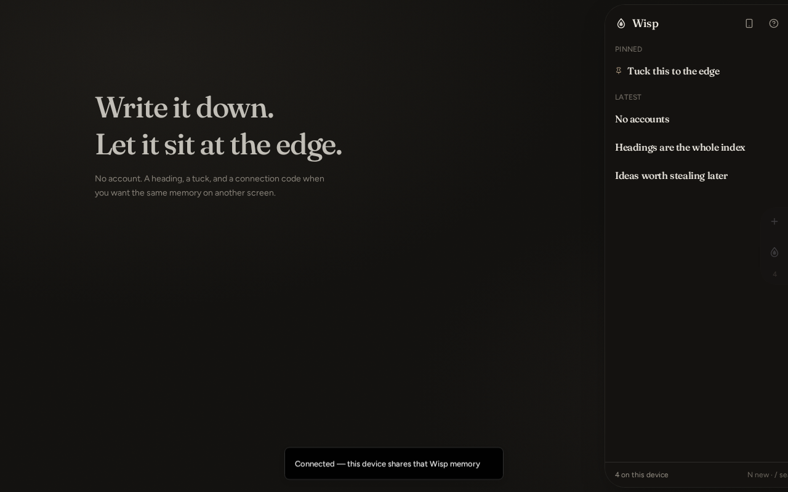
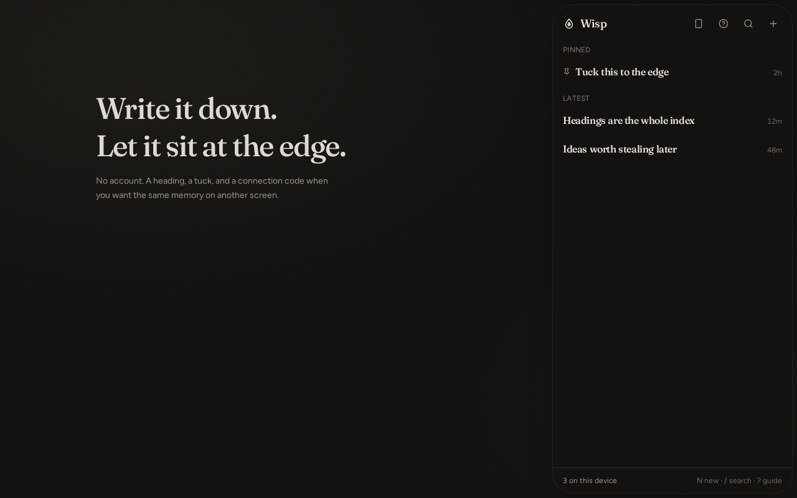
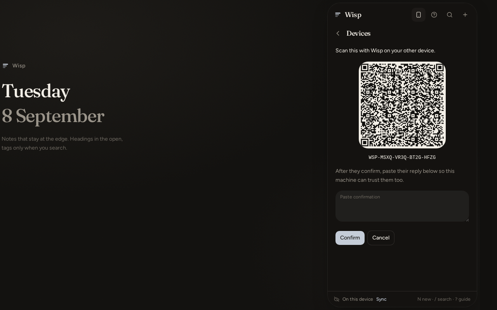

<p align="center">
  
</p>

<h1 align="center">Wisp</h1>

<p align="center"><strong>A tiny personal memory at the edge of the screen.</strong></p>

<p align="center">Write a heading. Tuck it away. Pull it back when you need it.</p>

<p align="center">
  <a href="https://github.com/VirajSankhla/Wisp/releases/latest"></a>
  <a href="https://github.com/VirajSankhla/Wisp/releases"></a>
  <a href="https://github.com/VirajSankhla/Wisp/stargazers"></a>
  <a href="https://github.com/VirajSankhla/Wisp/actions/workflows/release-native.yml"></a>
</p>

<p align="center">
  
  
  
  
</p>

Wisp is **personal-first and local-first**. Offline. No account. No Wisp cloud. Fonts, icons, and the flame animation all live in the app — the only network trip is the optional API you add for sync.

<p align="center">
  
  
  
</p>

---

## Why Wisp

Most notes apps make you open the app first. Wisp reverses that: the note is already at the edge of the screen. Open it, write something, tuck it away again.

- **Heading-first.** The list shows one line per thought. Open a note when you need the rest.
- **Edge-first.** A drop lives on the right edge of your screen — over your desktop, over other apps on Android, over other windows on Windows.
- **Instant capture.** `N` for a new note, from anywhere. The gap between having a thought and saving it should be nearly zero.
- **Tags without clutter.** `#tag` filters the list, but tags stay invisible until you search — no metadata soup.
- **Offline by default.** No internet, no account, no server — Wisp still works.
- **Sync only if you choose it.** Pair two devices with a QR code, point them at a JSON endpoint you control, or hand-carry an encrypted file. Never because Wisp said so.

```
N            new note
/ or ⌘K      search headings and #tags
Esc          back, then tuck to the edge
?            open the guide
```

---

## Get Wisp

| Device | Install | Edge drop |
| --- | --- | --- |
| **Windows** | [`.exe` from Releases](https://github.com/VirajSankhla/Wisp/releases) | Devices → **Enable edge tab**. Always-on-top drop over other windows — a browser install can't do this. |
| **Android** | [`.apk` from Releases](https://github.com/VirajSankhla/Wisp/releases) | Devices → **Enable edge tab** → allow *Display over other apps*. Hides while Wisp is open, appears when you leave. |
| **Mac / Linux** | build from source (Tauri) | Same edge tab as Windows. |
| **iPhone / iPad** | Safari → Share → **Add to Home Screen** | Not possible — Apple doesn't allow a third-party overlay. |
| **Any browser** | just open it | No overlay, full app. |

No sign-up. No Google. No X.

> If Releases looks empty, the latest build may still be running on **[Actions](https://github.com/VirajSankhla/Wisp/actions)**.

---

## The edge drop, in detail

On Android and Windows, Wisp can sit *outside* itself: a small drop pinned to the right edge of the screen, over whatever else you're doing.

- Tap or click it to pull out your latest headings without leaving what you're doing.
- Drag it to the **×** at the bottom of the screen to turn it off.
- Settings → **Edge drop size** (Compact / Regular / Large) and how many headings show before it scrolls.
- Notes made in the overlay and notes made in the full app are **the same notes**, live — no separate notebook.

---

## Same notes on phone and laptop

**You don't need this.** One device is the default, and it's complete on its own.

### Option 1 — an API you control (works over any network)

Easiest free start: [jsonbin.io](https://jsonbin.io).

1. Create a bin, leave it as `{}`. Copy the bin id and the **X-Master-Key**.
2. In Wisp: Devices → URL `https://api.jsonbin.io/v3/b/YOUR_BIN_ID`, header `X-Master-Key: YOUR_KEY` → **Save API**. Wisp uploads the notes already on that device.
3. Tap **Show a code**, scan it on the other device. From then on both stay matched, even on cellular.

| Host | URL | Header |
| --- | --- | --- |
| JSONBin | `https://api.jsonbin.io/v3/b/<id>` | `X-Master-Key: …` |
| jsonstorage.net | `https://jsonstorage.net/api/items/<id>` | optional |
| Your own server | any endpoint that answers GET + PUT with JSON | one `Name: value` line |

The payload is encrypted before it leaves the device. Wisp doesn't host or read the bin — it's yours.

### Option 2 — no API, fully offline

**Send notes / Receive notes** in Devices moves an encrypted packet by hand — copy/paste, share sheet, or a saved file.

### What the QR code actually is

Not a login. Not a Wisp account.

| Code | Meaning |
| --- | --- |
| `WISP.…` | A short-lived lock (~70–80 characters, expires in 5 minutes). |
| `WISP2.…` | That same lock, plus your saved API URL, bundled into one scan. |

---

## Host it yourself

No paid API, no OAuth, no database required.

```sh
git clone https://github.com/VirajSankhla/Wisp.git
cd Wisp
npm install
npm run dev        # http://localhost:8080
```

```sh
npm run build
npx vite preview --host 0.0.0.0 --port 8080
```

```sh
docker build -t wisp .
docker run -p 8080:8080 wisp
```

---

## Develop

```sh
npm install
npm run dev         # local dev server
npm run typecheck
npm test
npm run lint
npm run build        # also builds native-dist for Tauri/Capacitor
```

```
src/components/wisp/       panel, list, editor, overlay, desktop drop, settings
src/lib/notes/             store, search, merge, backup, fault log
src/lib/pairing/           connection codes, invites, encrypted sync
src/lib/prefs.ts           density + overlay row count
plugins/wisp-overlay/      Android edge-tab plugin (Capacitor)
src-tauri/                 Windows/Mac/Linux desktop shell (Tauri)
.github/workflows/         builds the .apk and .exe on every run
```

---

## Non-goals

Not Notion, not Evernote, not a task manager, not a social network, not an AI chatbot, not an account-based SaaS. The simplicity is the product.

Fork it. Host it. Install it. Write it down. Let it disappear again.
